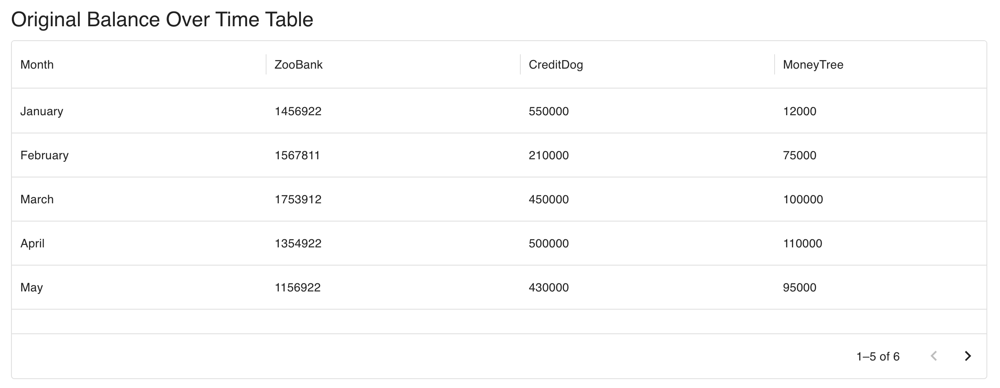
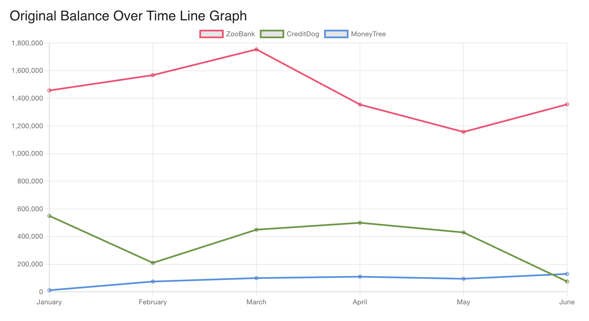
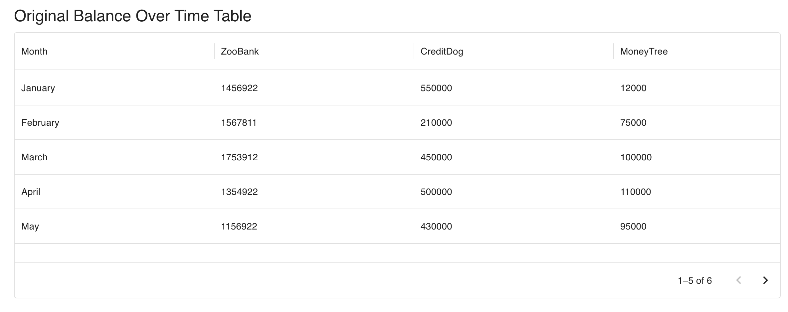

# Frontend Coding Challenge - FiveSigma

## Overview

This is my submission for the **FiveSigma Frontend Coding Challenge**. The challenge involved building a frontend application using **React** to visualize data through **tables** and **charts**. The data was fetched from local JSON files, and the application used **MUI X Data Grid** for the tables and **Chart.js** for the charts.

## Task Breakdown

The challenge consists of the following tasks:

1. **Create a Table Showing Original Balance Over Time**
   - A table visualizing the original balance over time (dataset: `DatasetOne`).

2. **Create a Chart Showing Original Balance Over Time**
   - A line chart showing the original balance over time for different origination partners (`ZooBank`, `CreditDog`, `MoneyTree`).

3. **Create a Table Showing the Current Interest Rate by Region**
   - A table showing the current interest rate by region (dataset: `DatasetTwo`).

4. **Create a Chart Showing the Current Interest Rate by Region**
   - A line chart displaying the current interest rate by region for each origination partner.

## Technologies Used

- **React**: JavaScript library for building user interfaces.
- **Material UI (MUI)**: UI framework used for building responsive, styled components (specifically the MUI X Data Grid for tables).
- **Chart.js**: JavaScript charting library used for rendering line charts.
- **TypeScript**: Used for static type checking and ensuring code reliability.
- **React Router**: For routing between different views (tables and charts).

## Project Structure

```plaintext
src/
├── pages/
│   ├── tableOne.tsx         # Table for DatasetOne (Original Balance)
│   ├── chartOne.tsx         # Chart for DatasetOne (Original Balance)
│   ├── tableTwo.tsx         # Table for DatasetTwo (Interest Rate by Region)
│   ├── chartTwo.tsx         # Chart for DatasetTwo (Interest Rate by Region)
│   ├── home.tsx             # Homepage component
├── utils/
│   ├── getData.tsx           # Fetches data from local JSON files
├── App.tsx                  # Main App component
├── index.tsx                # Entry point for React app
```

## Setup Instructions

To run this project locally, follow these steps:

### 1. Clone the Repository

Fork the repository to your GitHub account, then clone it to your local machine.

```bash
git clone https://github.com/your-username/frontend-coding-challenge.git
cd frontend-coding-challenge
```

### 2. Install Dependencies

Make sure you have Node.js and npm/yarn installed. Then install the project dependencies:

```bash
npm install
```

or

```bash
yarn install
```

### 3. Run the Application

Start the development server:

```bash
npm start
```

or

```bash
yarn start
```

This will open the app at `http://localhost:3000`.

### 4. Available Routes

- **/balanceTable**: Table showing the original balance over time (Dataset One).
- **/balanceChart**: Chart showing the original balance over time (Dataset One).
- **/interestRateTable**: Table showing the current interest rate by region (Dataset Two).
- **/interestRateChart**: Chart showing the current interest rate by region (Dataset Two).

## Features

### 1. **Table Showing Original Balance Over Time**

This table visualizes the original balance over time for different origination partners. It uses MUI X Data Grid for rendering and features pagination, sorting, and proper data formatting.

**Component:** `tableOne.tsx`

**Route:** `/balanceTable`



### 2. **Chart Showing Original Balance Over Time**

This chart displays the `originalBalance` over time for different origination partners. The data is grouped by month, and each partner is represented by a different color line.

**Component:** `chartOne.tsx`

**Route:** `/balanceChart`



### 3. **Table Showing Current Interest Rate by Region**

This table shows the current interest rate by region for different origination partners. It uses the MUI X Data Grid to display data by region.

**Component:** `tableTwo.tsx`

**Route:** `/interestRateTable`



### 4. **Chart Showing Current Interest Rate by Region**

This chart displays the current interest rates by region for each origination partner. The regions are plotted on the X-axis, and the interest rates are plotted on the Y-axis.

**Component:** `chartTwo.tsx`

**Route:** `/interestRateChart`


## Error Handling

- If data is missing or incorrectly formatted, an error message will be displayed on the UI.
- There are loading states that inform users when the data is being fetched.

## Conclusion

This project is designed to demonstrate my skills in building frontend applications using React, MUI, and Chart.js. It adheres to best practices in terms of component structure, data handling, and responsiveness.
